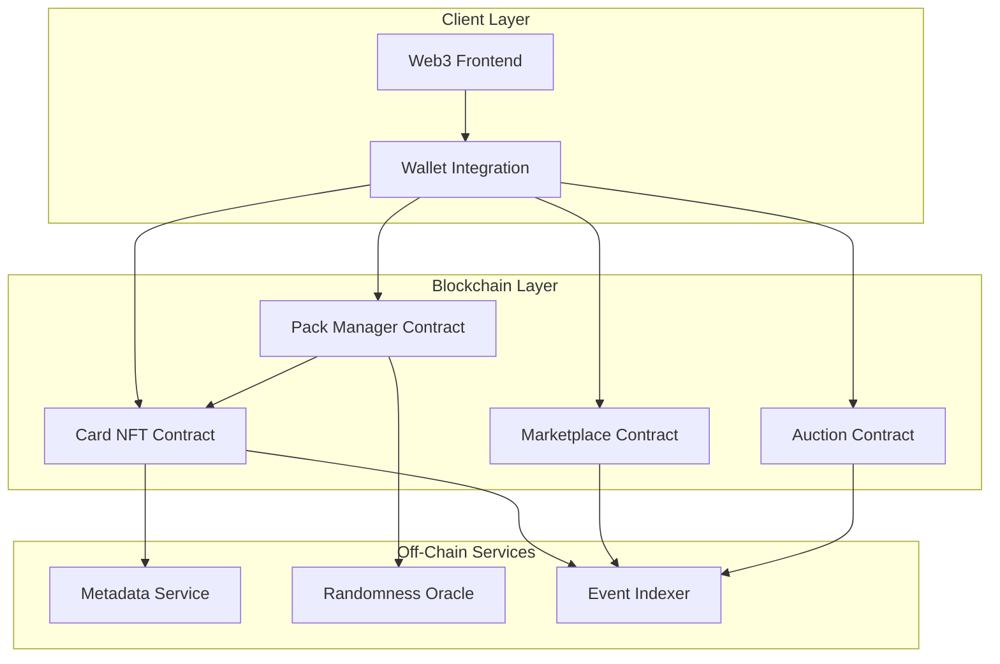

# Design Document

## Overview

The blockchain trading card platform is built on a smart contract architecture that manages NFT minting, ownership, trading, and auctions. The system uses ERC-721 standard for NFT tokens with extended metadata for player profiles. The platform consists of on-chain smart contracts for core logic and off-chain services for metadata management and user interface.

## Architecture

### High-Level Architecture



### Technology Stack

- **Smart Contracts**: Solidity (EVM-compatible blockchain)
- **Target Network**: Sepolia Testnet (Ethereum)
- **Token Standard**: ERC-721 (NFT) with metadata extensions
- **Randomness**: Chainlink VRF (Sepolia deployment)
- **Metadata Storage**: IPFS for decentralized storage
- **Frontend**: Web3.js/Ethers.js for blockchain interaction
- **Indexing**: The Graph or custom event indexer

## Components and Interfaces

### 1. Card NFT Contract

The core NFT contract managing card tokens and ownership.

**Responsibilities:**
- Mint new card tokens
- Store card metadata references
- Manage ownership transfers
- Implement ERC-721 standard

**Key Functions:**
```solidity
function mintCard(address to, uint256 playerId, uint8 rarity) external returns (uint256 tokenId)
function getCardMetadata(uint256 tokenId) external view returns (CardMetadata memory)
function transferCard(address from, address to, uint256 tokenId) external
```

**State Variables:**
- `mapping(uint256 => CardMetadata) private _cardData` - Card metadata by token ID
- `uint256 private _tokenIdCounter` - Auto-incrementing token ID
- `mapping(uint8 => uint256) public raritySupply` - Track supply by rarity

### 2. Pack Manager Contract

Handles pack purchases and card minting with randomness.

**Responsibilities:**
- Process pack purchases
- Request randomness for card generation
- Coordinate card minting
- Manage pack pricing and configuration

**Key Functions:**
```solidity
function purchasePack(uint8 packType) external payable returns (uint256 requestId)
function fulfillRandomness(uint256 requestId, uint256 randomness) external
function openPack(uint256 requestId) external returns (uint256[] memory tokenIds)
```

**State Variables:**
- `mapping(uint8 => PackConfig) public packTypes` - Pack configurations
- `mapping(uint256 => PendingPack) private _pendingPacks` - Packs awaiting randomness
- `mapping(uint8 => uint256[]) private _playerPoolByRarity` - Available players per rarity

**Pack Configuration:**
```solidity
struct PackConfig {
    uint256 price;
    uint8 cardCount;
    uint8[] rarityWeights; // Probability distribution
}
```

### 3. Marketplace Contract

Facilitates peer-to-peer trading between users.

**Responsibilities:**
- Create trade proposals
- Manage trade approvals
- Execute atomic swaps
- Cancel trades

**Key Functions:**
```solidity
function createTrade(uint256[] calldata offeredCards, uint256[] calldata requestedCards, address counterparty) external returns (uint256 tradeId)
function approveTrade(uint256 tradeId) external
function cancelTrade(uint256 tradeId) external
function executeTrade(uint256 tradeId) internal
```

**State Variables:**
- `mapping(uint256 => Trade) public trades` - Active trades
- `uint256 private _tradeIdCounter` - Trade ID counter

**Trade Structure:**
```solidity
struct Trade {
    address initiator;
    address counterparty;
    uint256[] offeredCards;
    uint256[] requestedCards;
    bool initiatorApproved;
    bool counterpartyApproved;
    TradeStatus status;
}
```

### 4. Auction Contract

Manages time-based auctions for card sales.

**Responsibilities:**
- Create auction listings
- Accept and validate bids
- Handle bid refunds
- Settle auctions

**Key Functions:**
```solidity
function createAuction(uint256 tokenId, uint256 startingPrice, uint256 duration, uint256 minBidIncrement) external returns (uint256 auctionId)
function placeBid(uint256 auctionId) external payable
function settleAuction(uint256 auctionId) external
function cancelAuction(uint256 auctionId) external
```

**State Variables:**
- `mapping(uint256 => Auction) public auctions` - Active auctions
- `uint256 private _auctionIdCounter` - Auction ID counter

**Auction Structure:**
```solidity
struct Auction {
    address seller;
    uint256 tokenId;
    uint256 startingPrice;
    uint256 currentBid;
    address currentBidder;
    uint256 endTime;
    uint256 minBidIncrement;
    AuctionStatus status;
}
```

## Data Models

### CardMetadata

```solidity
struct CardMetadata {
    uint256 playerId;
    uint8 rarity;
    uint256 mintTimestamp;
    string metadataURI; // IPFS link to full metadata
}
```

### Player Profile (Off-chain JSON)

```json
{
  "playerId": 1001,
  "name": "Player Name",
  "position": "Forward",
  "team": "Team Name",
  "stats": {
    "goals": 25,
    "assists": 12,
    "rating": 87
  },
  "image": "ipfs://...",
  "rarity": "Legendary"
}
```

### Rarity Tiers

```solidity
enum Rarity {
    Common,      // 60% probability
    Uncommon,    // 25% probability
    Rare,        // 10% probability
    Epic,        // 4% probability
    Legendary    // 1% probability
}
```

## Error Handling

### Smart Contract Errors

**Pack Manager:**
- `InsufficientPayment()` - User didn't send enough ETH for pack
- `InvalidPackType()` - Pack type doesn't exist
- `RandomnessNotFulfilled()` - Attempting to open pack before randomness arrives
- `PackAlreadyOpened()` - Attempting to open already-opened pack

**Marketplace:**
- `UnauthorizedCaller()` - Caller is not part of the trade
- `TradeAlreadyExecuted()` - Trade has already been completed
- `InvalidCardOwnership()` - User doesn't own offered cards
- `TradeExpired()` - Trade proposal has expired

**Auction:**
- `AuctionNotActive()` - Auction has ended or been cancelled
- `BidTooLow()` - Bid doesn't meet minimum requirements
- `NotCardOwner()` - Caller doesn't own the card being auctioned
- `AuctionStillActive()` - Attempting to settle before end time
- `InsufficientBalance()` - Bidder doesn't have enough funds

### Transaction Reversion

All state-changing operations use Solidity's built-in revert mechanisms to ensure atomicity. Failed transactions automatically revert all state changes and return gas to users (minus execution costs).

### Event Emission

All critical operations emit events for off-chain tracking:

```solidity
event PackPurchased(address indexed buyer, uint8 packType, uint256 requestId);
event CardMinted(uint256 indexed tokenId, address indexed owner, uint256 playerId, uint8 rarity);
event TradeCreated(uint256 indexed tradeId, address indexed initiator, address indexed counterparty);
event TradeExecuted(uint256 indexed tradeId);
event AuctionCreated(uint256 indexed auctionId, uint256 indexed tokenId, address indexed seller);
event BidPlaced(uint256 indexed auctionId, address indexed bidder, uint256 amount);
event AuctionSettled(uint256 indexed auctionId, address indexed winner, uint256 finalPrice);
```

## Testing Strategy

### Unit Tests

**Card NFT Contract:**
- Test minting with various rarity levels
- Verify metadata storage and retrieval
- Test ownership transfers
- Validate ERC-721 compliance

**Pack Manager Contract:**
- Test pack purchase with correct payment
- Verify randomness request flow
- Test card distribution matches rarity weights
- Validate multiple pack openings

**Marketplace Contract:**
- Test trade creation and approval flow
- Verify atomic swap execution
- Test trade cancellation
- Validate authorization checks

**Auction Contract:**
- Test auction creation and listing
- Verify bid validation and refund logic
- Test auction settlement with and without bids
- Validate time-based constraints

### Integration Tests

- End-to-end pack purchase and opening flow
- Complete trade execution between two users
- Full auction lifecycle from creation to settlement
- Cross-contract interactions (e.g., marketplace accessing NFT contract)

### Security Considerations

- **Reentrancy Protection**: Use OpenZeppelin's ReentrancyGuard on all payable functions
- **Access Control**: Implement role-based permissions for admin functions
- **Integer Overflow**: Use Solidity 0.8+ built-in overflow checks
- **Front-running**: Use commit-reveal for sensitive operations if needed
- **Randomness**: Use Chainlink VRF to prevent manipulation of card generation
- **Escrow Safety**: Ensure cards and funds are properly locked during trades/auctions

### Gas Optimization

- Batch operations where possible (e.g., minting multiple cards)
- Use events instead of storage for historical data
- Optimize struct packing to minimize storage slots
- Consider ERC-721A for batch minting efficiency

## Deployment Considerations

### Contract Deployment Order

1. Deploy Card NFT Contract
2. Deploy Pack Manager Contract (with Card NFT address)
3. Deploy Marketplace Contract (with Card NFT address)
4. Deploy Auction Contract (with Card NFT address)
5. Configure Pack Manager with player pool and pack types
6. Grant minting permissions to Pack Manager

### Configuration Parameters

- Pack prices and card counts
- Rarity probability distributions
- Minimum bid increments for auctions
- Platform fee percentages (if applicable)
- Chainlink VRF Coordinator address (Sepolia: 0x8103B0A8A00be2DDC778e6e7eaa21791Cd364625)
- Chainlink VRF subscription ID for Sepolia testnet
- Key hash for Chainlink VRF on Sepolia

### Upgrade Strategy

Consider using proxy patterns (e.g., UUPS or Transparent Proxy) for upgradability, especially for:
- Pack Manager (to adjust pack configurations)
- Marketplace (to add new trading features)
- Auction (to modify auction mechanics)

The Card NFT Contract should remain immutable to ensure token permanence and user trust.
