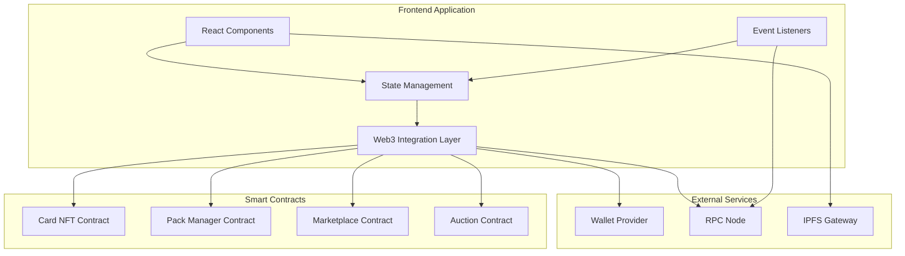

# Design Document

## Overview

The frontend web application is a modern, responsive single-page application (SPA) that provides users with an intuitive interface to interact with the blockchain trading card platform. Built with React and Web3 libraries, it handles wallet connections, transaction management, real-time blockchain event listening, and provides an engaging user experience with animations and responsive design.

## Architecture

### High-Level Architecture



### Technology Stack

- **Framework**: React 18+ with TypeScript
- **Build Tool**: Vite for fast development and optimized builds
- **Web3 Library**: wagmi + viem for type-safe Ethereum interactions
- **Wallet Connection**: RainbowKit for multi-wallet support
- **State Management**: Zustand for lightweight global state
- **Styling**: TailwindCSS for utility-first styling
- **Animations**: Framer Motion for smooth transitions and pack opening animations
- **UI Components**: Radix UI for accessible component primitives
- **Icons**: Lucide React for consistent iconography
- **HTTP Client**: TanStack Query for data fetching and caching
- **Routing**: React Router for navigation

## Components and Interfaces

### 1. Wallet Connection Component

**Responsibilities:**
- Display wallet connection button
- Handle wallet provider selection
- Show connected wallet address
- Manage network switching
- Display connection status

**Key Features:**
- Multi-wallet support (MetaMask, WalletConnect, Coinbase Wallet)
- Network validation and switching prompts
- Account change detection
- Disconnect functionality

**Component Structure:**
```tsx
<WalletButton>
  {isConnected ? (
    <ConnectedWallet address={address} />
  ) : (
    <ConnectButton />
  )}
</WalletButton>
```

### 2. Pack Store Component

**Responsibilities:**
- Display available pack types
- Show pack details (price, card count, rarity distribution)
- Handle pack purchase transactions
- Display purchase confirmation

**Key Features:**
- Pack type cards with visual design
- Price display in ETH
- Rarity distribution visualization
- Purchase button with loading states
- Transaction confirmation modal

**Component Structure:**
```tsx
<PackStore>
  <PackGrid>
    {packTypes.map(pack => (
      <PackCard
        key={pack.id}
        pack={pack}
        onPurchase={handlePurchase}
      />
    ))}
  </PackGrid>
</PackStore>
```

### 3. Pack Opening Component

**Responsibilities:**
- Display pending packs
- Trigger pack opening transaction
- Animate card reveal
- Show newly minted cards

**Key Features:**
- 3D pack opening animation
- Sequential card reveal with flip animation
- Rarity-based visual effects (sparkles for legendary)
- Sound effects (optional)
- Skip animation option

**Animation Flow:**
1. Pack appears in center
2. Pack opens with 3D rotation
3. Cards fly out one by one
4. Each card flips to reveal front
5. Final collection display

**Component Structure:**
```tsx
<PackOpening>
  <AnimatedPack onOpen={handleOpen} />
  <CardRevealSequence cards={revealedCards} />
  <CollectionButton onClick={goToCollection} />
</PackOpening>
```

### 4. Collection View Component

**Responsibilities:**
- Display all owned cards
- Provide filtering and sorting
- Show card details on click
- Enable card selection for trading/auction

**Key Features:**
- Grid layout with responsive columns
- Filter by rarity, position, team
- Sort by date, rarity, rating
- Search by player name
- Card detail modal
- Bulk selection mode

**Component Structure:**
```tsx
<CollectionView>
  <CollectionHeader>
    <SearchBar />
    <FilterControls />
    <SortControls />
  </CollectionHeader>
  <CardGrid>
    {filteredCards.map(card => (
      <CardItem
        key={card.tokenId}
        card={card}
        onClick={showDetails}
      />
    ))}
  </CardGrid>
</CollectionView>
```

### 5. Card Detail Modal

**Responsibilities:**
- Display full card information
- Show player statistics
- Display transaction history
- Provide action buttons (trade, auction)

**Key Features:**
- Large card image
- Player profile details
- Rarity badge
- Mint date and token ID
- Action buttons (List for Auction, Create Trade)
- Transaction history timeline

### 6. Trading Interface Component

**Responsibilities:**
- Create trade proposals
- Display pending trades
- Handle trade approvals
- Execute trades

**Key Features:**
- Card selection interface
- Counterparty address input
- Trade proposal preview
- Pending trades list
- Approve/Reject buttons
- Trade history

**Component Structure:**
```tsx
<TradingInterface>
  <CreateTrade>
    <CardSelector cards={ownedCards} />
    <CounterpartyInput />
    <TradePreview />
  </CreateTrade>
  <PendingTrades>
    {trades.map(trade => (
      <TradeCard
        key={trade.id}
        trade={trade}
        onApprove={handleApprove}
        onReject={handleReject}
      />
    ))}
  </PendingTrades>
</TradingInterface>
```

### 7. Auction Interface Component

**Responsibilities:**
- Create auction listings
- Display active auctions
- Handle bid placement
- Show auction results

**Key Features:**
- Auction creation form
- Active auctions grid
- Countdown timers
- Bid input with validation
- Auction detail view
- Settlement button

**Component Structure:**
```tsx
<AuctionInterface>
  <CreateAuction>
    <CardSelector />
    <PriceInput />
    <DurationSelector />
  </CreateAuction>
  <ActiveAuctions>
    {auctions.map(auction => (
      <AuctionCard
        key={auction.id}
        auction={auction}
        onBid={handleBid}
      />
    ))}
  </ActiveAuctions>
</AuctionInterface>
```

### 8. Transaction Manager Component

**Responsibilities:**
- Track transaction states
- Display transaction notifications
- Provide transaction history
- Handle transaction errors

**Key Features:**
- Toast notifications for transaction updates
- Transaction pending indicator
- Block explorer links
- Error handling with retry options
- Transaction history drawer

## Data Models

### Card Data Model

```typescript
interface Card {
  tokenId: string;
  playerId: string;
  playerName: string;
  position: string;
  team: string;
  rarity: Rarity;
  imageUrl: string;
  stats: PlayerStats;
  mintTimestamp: number;
  metadataUri: string;
}

interface PlayerStats {
  goals: number;
  assists: number;
  rating: number;
}

enum Rarity {
  Common = 0,
  Uncommon = 1,
  Rare = 2,
  Epic = 3,
  Legendary = 4
}
```

### Pack Data Model

```typescript
interface PackType {
  id: number;
  name: string;
  price: bigint;
  cardCount: number;
  rarityWeights: number[];
  imageUrl: string;
  description: string;
}

interface PendingPack {
  requestId: string;
  packType: number;
  buyer: string;
  fulfilled: boolean;
  timestamp: number;
}
```

### Trade Data Model

```typescript
interface Trade {
  tradeId: string;
  initiator: string;
  counterparty: string;
  offeredCards: Card[];
  requestedCards: Card[];
  initiatorApproved: boolean;
  counterpartyApproved: boolean;
  status: TradeStatus;
  createdAt: number;
}

enum TradeStatus {
  Pending = 0,
  Executed = 1,
  Cancelled = 2
}
```

### Auction Data Model

```typescript
interface Auction {
  auctionId: string;
  seller: string;
  card: Card;
  startingPrice: bigint;
  currentBid: bigint;
  currentBidder: string;
  endTime: number;
  minBidIncrement: bigint;
  status: AuctionStatus;
}

enum AuctionStatus {
  Active = 0,
  Settled = 1,
  Cancelled = 2
}
```

## State Management

### Global State Structure

```typescript
interface AppState {
  // Wallet state
  wallet: {
    address: string | null;
    chainId: number | null;
    isConnected: boolean;
  };
  
  // User data
  user: {
    cards: Card[];
    pendingPacks: PendingPack[];
    trades: Trade[];
    auctions: Auction[];
  };
  
  // UI state
  ui: {
    isLoading: boolean;
    activeModal: string | null;
    notifications: Notification[];
  };
  
  // Transaction state
  transactions: {
    pending: Transaction[];
    history: Transaction[];
  };
}
```

### State Management Strategy

- **Zustand** for global app state (wallet, user data, UI state)
- **TanStack Query** for server state (blockchain data, IPFS metadata)
- **React Context** for theme and localization
- **Local component state** for form inputs and temporary UI state

## Error Handling

### Transaction Errors

**User Rejection:**
- Display friendly message: "Transaction cancelled"
- No retry needed

**Insufficient Funds:**
- Display error with current balance
- Suggest reducing amount or adding funds

**Network Errors:**
- Display error with network status
- Provide retry button
- Suggest checking RPC connection

**Contract Errors:**
- Parse revert reason from error
- Display user-friendly message
- Provide context-specific help

### Loading States

**Transaction Pending:**
- Show spinner with transaction hash
- Display estimated time
- Provide block explorer link

**Data Loading:**
- Show skeleton loaders for cards
- Display loading spinner for lists
- Maintain layout to prevent shift

### Error Boundaries

- Implement React Error Boundaries for component crashes
- Display fallback UI with error details
- Provide "Report Issue" button
- Log errors to monitoring service

## Responsive Design

### Breakpoints

```css
sm: 640px   /* Mobile landscape */
md: 768px   /* Tablet */
lg: 1024px  /* Desktop */
xl: 1280px  /* Large desktop */
2xl: 1536px /* Extra large */
```

### Layout Strategy

**Mobile (< 768px):**
- Single column layout
- Bottom navigation bar
- Collapsible filters
- Full-screen modals

**Tablet (768px - 1024px):**
- Two column card grid
- Side navigation drawer
- Modal dialogs

**Desktop (> 1024px):**
- Three+ column card grid
- Persistent sidebar navigation
- Modal dialogs with backdrop

## Accessibility

### WCAG 2.1 AA Compliance

- **Keyboard Navigation**: All interactive elements accessible via keyboard
- **Screen Readers**: Proper ARIA labels and roles
- **Color Contrast**: Minimum 4.5:1 ratio for text
- **Focus Indicators**: Visible focus states for all interactive elements
- **Alt Text**: Descriptive alt text for all images

### Accessibility Features

- Skip to main content link
- Semantic HTML structure
- Form labels and error messages
- Loading announcements for screen readers
- Reduced motion support

## Performance Optimization

### Code Splitting

- Route-based code splitting
- Lazy load heavy components (pack opening animation)
- Dynamic imports for modals

### Asset Optimization

- Image lazy loading
- WebP format with fallbacks
- Responsive images with srcset
- Icon sprite sheets

### Caching Strategy

- Cache blockchain data with TanStack Query
- Cache IPFS metadata locally
- Service worker for offline support
- Optimistic UI updates

### Bundle Optimization

- Tree shaking unused code
- Minification and compression
- CDN for static assets
- Preload critical resources

## Testing Strategy

### Unit Tests

- Component rendering tests
- Hook logic tests
- Utility function tests
- State management tests

### Integration Tests

- Wallet connection flow
- Pack purchase and opening
- Trade creation and execution
- Auction bidding flow

### E2E Tests

- Complete user journeys
- Multi-wallet scenarios
- Error handling flows
- Responsive design validation

### Accessibility Tests

- Automated a11y testing with axe
- Keyboard navigation testing
- Screen reader compatibility

## Deployment

### Build Process

1. Run TypeScript type checking
2. Run linting and formatting
3. Run test suite
4. Build production bundle
5. Generate source maps
6. Optimize assets

### Hosting Options

- **Vercel**: Automatic deployments from Git
- **Netlify**: CDN and serverless functions
- **IPFS**: Decentralized hosting
- **AWS S3 + CloudFront**: Scalable static hosting

### Environment Configuration

```env
VITE_CHAIN_ID=11155111 # Sepolia
VITE_RPC_URL=https://sepolia.infura.io/v3/...
VITE_CARD_NFT_ADDRESS=0x...
VITE_PACK_MANAGER_ADDRESS=0x...
VITE_MARKETPLACE_ADDRESS=0x...
VITE_AUCTION_ADDRESS=0x...
VITE_IPFS_GATEWAY=https://ipfs.io/ipfs/
VITE_WALLETCONNECT_PROJECT_ID=...
```

### CI/CD Pipeline

1. Push to Git repository
2. Run automated tests
3. Build production bundle
4. Deploy to staging environment
5. Run E2E tests on staging
6. Deploy to production (manual approval)
7. Monitor for errors

## Security Considerations

### Input Validation

- Validate all user inputs client-side
- Sanitize data before display
- Validate addresses with checksums
- Prevent XSS attacks

### Transaction Security

- Display transaction details before signing
- Warn about high gas prices
- Validate contract addresses
- Use secure RPC endpoints

### Data Privacy

- No sensitive data in localStorage
- Secure API keys in environment variables
- HTTPS only in production
- No tracking without consent

### Wallet Security

- Never request private keys
- Use read-only contract calls when possible
- Clear sensitive data on disconnect
- Warn about phishing attempts
